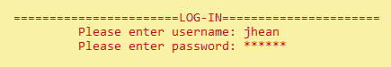
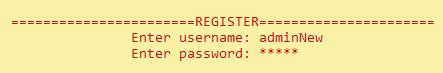

# CANTEEN MANAGEMENT SYSTEM

_Greetings!_ our **Canteen Management System** is a console application<br> that aims to provide a simple 
and easy to use application to assist<br>with ordering and inventory management.

This application has: 
- Admin Option
    - Log-In and Registration System
    - Inventory Management System
- User Option
    - Ordering System

---
## LANDING PAGE


Our application starts with a landing page consisting of the name of the canteen.

---

## MODE PAGE


The second page we have is our **Mode Option**, <br>wherein a user can select if they wanted to use the application on admin or user mode


---


## ADMIN OPTION FEATURES


### LOG-IN & REGISTRATION SYSTEM

The application's log-in and registration system used _file handling_.<br>
Wherein we stored the username and password inside a _txt file_.<br>
We decided to have a log-in and registration system in order to provide<br>
security with the inventory.

<br>
<br>
We included a function we made called ```hideWord()```<br> 
which uses the ```getch()``` to store user input while<br>
outputting an (*) to the console to have its Login feel to it.<br> 

### INVENTORY MANAGEMENT SYSTEM

our inventory management system features: 
- Set Default Menu (daily)
- Set Customized Menu 
- Edit Current Menu
- Add to Menu
- Add/Refill Menu Inventory
- Display Menu
- Display Current Menu Inventory


**Set Regular Menu**
    : Sets the regular menu for the rest of the day, selecting this disables option number 2<br>
      The regular menu is hard coded and can be change thru the code only, but this application supports the
      <br> editing of current menu which may be an alternative.

**Set Customized Menu**
    : Feature that helps you set a customized menu for the day, though selecting option 1<br>
    disables this feature, this feature does not disables option 1, so selecting this feature and selecting option 1 <br>right after may overwrite the current customized menu.

**Edit Menu**
    : Feature that allows you to edit a specific thing on a menu, either name, price or stocks.

**Add to Menu**
    : Feature that allows you to add something in the current menu.

**Add Stocks**
    : Feature that allows you to add stocks if the item had sold out.

**Display Inventory**
    : Feature that allows you to see how many stocks per item you still have.

**Display Menu**
    : Feature that allows you to see what the menu looks like for the user/customer.

---

## USER OPTION FEATURE


In this mode, customers will see what is *available* at the current moment, <br>


Customers will be able to order either a Meal, Drink, or an extra, <br>
users have an option to skip certain order group. 


After the customer have selected what to order a prompt will be shown, <br>
consisting of a cart of there orders in which they will have an option to <br>
proceed to print receipt or cancel the following order.


Once the customer has proceeded the console will print a receipt consisting <br>
of the users order with its total price. The customer then will take a photo <br>
of that receipt and show it to the counter. Once the user has confirmed their <br>
order stocks of those ordered by the customer will directly be subtracted to <br>
the current stock that the product had.

---

**GROUP NAME** : T3CHNICAL

**GROUP MEMBERS** <br>
- Jhean Khendrick Galope
- Christian Harrel Go
- Adrian Naoe
- Mark Ryan Odrunia
        
---

**Download Instructions**

1. Click the green code button
1. Under that select download zip file
1. Go to your downloads folder
1. Extract the file 
1. Locate the extracted files
1. Run the .exe file

---

## **THANK YOU!**
